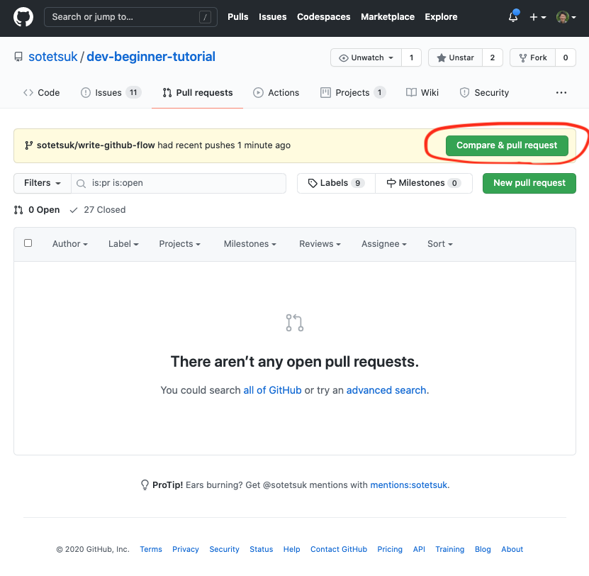
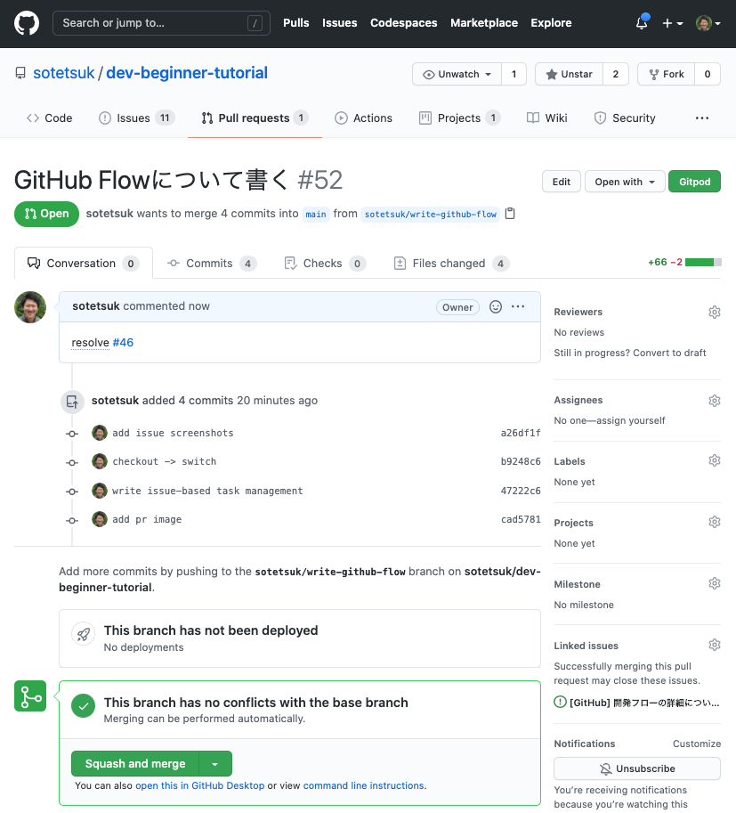

# GitHub入門

## :ok: これだけ！GitHub上での開発の流れ

はじめに、ここで学ぶことの結論をまとめてしまいます。GitHub上では、**Issueベースでのタスク管理**と、**Pull Request (PR) ベースでの開発**を行います。
    
!!! important "Issueベースでのタスク管理"

    何か必要な機能や修正があれば、まずIssueを作成して「なぜこの機能・修正が必要なのか」「その仕様は何なのか」を書き出します。
    実際に開発に移る機能や修正は、Issueリストの中から優先順位やタスクの依存関係などに応じて決定します。


!!! important "Pull Request (PR) ベースでの開発"

    1. 実装する機能・修正の仕様を決めます（解決するIssueを決めます）。
    1. `main` に移り、リモートリポジトリから最新の変更を取り込みます。 `git switch main && git pull origin main`
    2. 新しい機能を実装するブランチを `main` から作ります。 `git switch -c <branch name>`
    3. ブランチ上で機能を実装します。
        3. 変更を実装し、適宜コミットします。 `git add <file>` `git commit -m "<commit message>"`
        4. 適宜プッシュします。 `git push -u origin <branch name>` 特に、最初のコミット直後には一度プッシュしてPRを作り、Issueと関連付けます。
    5. 機能が完成したら、レビュー前に最新の `origin/main` を取り込みます。 `git fetch && git merge --no-ff origin/main` （競合が発生した場合は解決する）
    6. レビューを経てPRを `main` に "Squash And Merge" でマージします。

    !!! warning ""

        ここでは、他ユーザーのリポジトリを[ForkするタイプのPR](https://docs.github.com/ja/free-pro-team@latest/github/collaborating-with-issues-and-pull-requests/creating-a-pull-request-from-a-fork)ではなく、同じリポジトリを共有してその中だけで完結するPRを想定しています。


## :question: なぜGitHubの使い方を学ぶのか？

GitHubは、最も広く使われているソフトウェア開発のプラットフォームです。
前章で学んだGitのリポジトリを管理してくれる他、開発に必要な様々な便利な機能を提供してくれています。
多くのソフトウェアがGitHub上でオープンソースソフトウェア（OSS) として開発されており、
開発者がGitHub上で開発されたソフトウェアを使わない日はありません。
大学でも会社でも、チームでの開発においてGitHubを使う可能性はかなり高く、Gitに加えてGitHubの使い方を習得するのは現代エンジニアにとって必須だと言えます。

## :orange_book: GitHubを用いた基本的な開発の流れ

Git/GitHubを用いた開発フローに、何か一つの正解があるというわけではありません。
チームやプロジェクト毎に、それぞれの異なる開発フローやルールが存在するでしょう。
ただし、基本的な開発フローを一つ学べば、プロジェクトやチームに加わったあとですぐにキャッチアップできるはずです。
ここでは、シンプルかつよく知られたGit/GitHub上での開発フローである、GitHub Flowを参考に、GitHub上でのシンプルな開発の流れについて説明します。

!!! quote ""

    [GitHub Flow](http://scottchacon.com/2011/08/31/github-flow.html) [[日本語訳](https://gist.github.com/Gab-km/3705015)]

### :arrow_forward: Issueベースでのタスク管理

何か必要な機能や修正がある場合、まず、新しいIssueを作ります。
Issueには、

1. 一体どんな新しい機能・修正が必要なのか
2. なぜそれが必要なのか

などを書くと良いでしょう（チームやプロジェクトによって、書くべき項目がより細かく決まっている場合もあります）。
まずIssueに書くことによって、思いついた機能や修正をやみくもに思いついた順番に実装していくのではなく、
タスクを整理してから優先順位やタスクの依存関係などに応じて実装していくことが可能になります。

| [新しいIssueを作成する](https://github.com/sotetsuk/dev-beginner-tutorial/issues/new) | [投稿された未解決のIssueリスト](https://github.com/sotetsuk/dev-beginner-tutorial/issues) |
|:---:|:---:|
|  |  |

### :arrow_forward: PRベースでの開発

GitHub Flowでは、デフォルトブランチである `main` ブランチを**常に最新で問題がない（テストが通る）状態に保ち**、
すべての新しい機能追加・修正を `main` ブランチから新しくブランチを派生させることで実装していきます。
Issueの中から、解決すべきIssueを決め、何を実装すべきかが定まったら、まず `main` ブランチから新しいブランチを作成しましょう。

まず、 `main` ブランチに移り、リモートブランチから最新の情報を取り込みます。

```sh
$ git switch main
$ git pull origin main
```

更新できたら、実装をしていくブランチを新しく作ります。

```sh
$ git switch -c <new-branch-name>
```

ここで、ブランチ名はある程度、実装する機能や修正の内容がわかるよう心がけましょう。

ブランチを切ったら、そこで実装をして、こまめにコミットをしていきます。コミットメッセージもある程度、
どんな実装をしたのか分かるようにしていきましょう。

```sh
$ git add <file>
$ git commit -m "<commit message>"
```

**最初のコミットの直後に**、ブランチをプッシュしてPull Request (PR) を作り、他のチームメンバに自分がどんなタスクに着手したのかを共有し、議論可能にします。

```sh
$ git push -u origin <new-branch-name>
```

PRの作成は、ブランチのプッシュ後、GitHubのサイトから行うことができます。
PRの作成時には、タイトルと本文を入力します。
タイトルは一言でどんなことをしたのか、本文は（もしあれば）関連するIssueや、その実装方法（解決方法）などについて言及しましょう。
下の例では、[#52](https://github.com/sotetsuk/dev-beginner-tutorial/pull/52)のPRを新しく作成し、右図で言及されている[#46](https://github.com/sotetsuk/dev-beginner-tutorial/issues/46)のIssueを解決します。

| [新しいPRを作成する](https://github.com/sotetsuk/dev-beginner-tutorial/compare) | [作成されたPR](https://github.com/sotetsuk/dev-beginner-tutorial/pull/52) |
|:---:|:---:|
|  |  |

!!! warning ""

    GitHub上では、[#46](https://github.com/sotetsuk/dev-beginner-tutorial/issues/46)や[#52](https://github.com/sotetsuk/dev-beginner-tutorial/pull/52)のように、IssueやPRが#付きの連番で管理されています。

!!! warning ""

    GitHub上では、PRからIssueを関連付けすることができます（[プルリクエストをIssueにリンクする | GitHub Docs](https://docs.github.com/ja/free-pro-team@latest/github/managing-your-work-on-github/linking-a-pull-request-to-an-issue)）。
    特に、`resolves` や `fix` といったキーワードを付けることで、そのPRがマージされたときに自動でIssueを閉じることができます。

機能が完成したと思ったら、まず、このブランチに最新の `main` の更新を取り込みます。
あなたが機能を実装している間に、他の誰かが新しい機能を `main` ブランチに実装し、それが競合しているかもしれないからです。

```
$ git fetch && git merge --no-ff origin/main
```

次に、そのプロジェクトで設定されている自動テストがきちんと通ることを確認します（[継続的インテグレーション](https://ja.wikipedia.org/wiki/%E7%B6%99%E7%B6%9A%E7%9A%84%E3%82%A4%E3%83%B3%E3%83%86%E3%82%B0%E3%83%AC%E3%83%BC%E3%82%B7%E3%83%A7%E3%83%B3#:~:text=%E7%B6%99%E7%B6%9A%E7%9A%84%E3%82%A4%E3%83%B3%E3%83%86%E3%82%B0%E3%83%AC%E3%83%BC%E3%82%B7%E3%83%A7%E3%83%B3%E3%80%81CI%EF%BC%88%E8%8B%B1,%E3%83%9E%E3%83%BC%E3%82%B8%E3%81%99%E3%82%8B%E3%81%93%E3%81%A8%E3%81%A7%E3%81%82%E3%82%8B%E3%80%82)）。

!!! warning ""

    継続的インテグレーション (CI) の設定方法は次章で学びます。

テストが通ったら、チーム開発であれば他のメンバにレビューをお願いし、レビューが通ったらマージをします（あるいは他のメンバにマージしてもらいます）。

| レビュアをアサインする | PRをマージする |
|:---:|:---:|
|  |  |


これが、新しい機能の追加・修正における一回のサイクルになります。
このサイクルさえ覚えてしまえば、あとは同じことを繰り返すだけになります。

## :police_officer: Git/GitHubでの開発におけるNG集

初学者がやりがちな、Git/GitHub上での開発におけるNGな行為を上げておきます。

!!! failure "一つのPRに大量の変更を詰め込みすぎない"

    GitHub上での開発履歴を後から見直したとき、PRは開発における意味のあるまとまりの最小単位と捉えることができます。
    ひとつひとつのPRは、理想的にはレビューしやすく、手戻りも用意であるのが好ましいはずです。
    ひとつのPRで、いきなり数百行もの変更を送りつけるのはやめましょう。
    ひとつのPRは、ひとつの課題 (Issue) を解決することにだけ注力すべきです。
    変更行数が少ない分には全く問題がないので（たとえ一行だけの変更でも）、変更が大きくなりすぎないようにだけ注意しましょう。

!!! failure "大量のバイナリファイルをコミットしない"

    Gitは基本的に、テキストファイルをバージョン管理するためのツールです。
    バイナリファイルを追加しても、差分を確認することはできません。
    例えば、ビルドしたバイナリを丸ごとコミットするようなことは避けましょう。
    これは、初学者が `git add *` を不用意に使うことで起こることがあります。
    不用意な `git add *` の使用は避け、適切に `.gitignore` を設定しましょう。
    バイナリをコミットする代わりに、ビルドを自動化するためのCIを設定しましょう。
    もしバイナリを例外的にコミットする場合、その意図を明確に記述しましょう。

!!! failure "mainブランチにforce pushしない"

    これはリポジトリ管理者が不可能なように設定しておくべき項目でもありますが、
    `main` ブランチでの履歴の改変は好ましくありません。特にチームでの開発では避けましょう。

!!! failure "ブランチの再利用をしない"

    ある機能Aのために切って、既に `main` にマージされたブランチAを、全く別の機能Bのためにそのまま再利用するのはやめましょう。
    かならず最新の `main` から新しいブランチBを切って下さい。

!!! failure "ビルドやテストが通ってないブランチを `main` にマージしようとしない"

    基本的に、 `main` ブランチは常にテストが全て通った状態を保つようにしなければなりません。
    機能開発が終わった時点で、ビルドが通っていなかったり、テストが通っていない場合は、
    レビュアーのアサインの前に、実装を修正しましょう。


## :book: TIPS

絶対にこうした方がいい、というわけではないが、一定の利便性と合理性がある項目について説明します。

!!! tip "コミットメッセージにpefixをつける"

    コミットメッセージの先頭に次のようなprefixを加えることで視認性が高まることが期待できます。

    - `feat: `
    - `fix: `
    - `refactor: `
    - `docs: `

    > [【今日からできる】コミットメッセージに 「プレフィックス」 をつけるだけで、開発効率が上がった話 | Qiita](https://qiita.com/numanomanu/items/45dd285b286a1f7280ed)

!!! tip "PRのマージを `Squash and merge` にする"

    GitHubにおける開発でPRが機能追加・変更の最小単位であることを踏まえると、 `main` にマージする際、PRに紐付いたコミットを全てsquashしてひとつのマージコミットを作るのも合理的な選択の一つです。
    こうすると、後から `main` ブランチの履歴を見たとき、全ての変更にPRがひとつ紐付いており、そこからさらにIssueに辿りやすくなっているというメリットがあります。
    また、ひとつひとつのcommit messageは `main` の履歴には映らなくなるので、はそこまで気を使う必要がなくなるというのも利点です。
    実際、いくつかの有名OSSはこの方針を採用しています。

    !!! example ""

        - [github.com/denoland/deno](https://github.com/denoland/deno/commits/master)
        - [github.com/pytorch/pytorch](https://github.com/pytorch/pytorch)

    | "Squash and merge" ボタン | [github.com/denoland/deno](https://github.com/denoland/deno/commits/master) |
    |:---:|:---:|
    |  |  |

!!! tip "ブランチ名に作業者の名前や変更の種類を先頭につける"

    誰がどんな変更を加えているブランチなのかの視認性が少し良くなります。

    - `sotetsuk/feat/new-nn-model`
    - `sotetsuk/refactor/remove-comments`
    - `sotetsuk/docs/how-to-use`

!!! tip "まだ実装途中のPRにWIPとprefixをつけたり、Draft Pull Requestにする"

    まだPRの実装が完了していないことを明示的にするために、タイトルに `[WIP]` や　`WIP: ` のようなprefixをつける慣習があります。
    また、代わりにGitHubのDraft Pull Request機能を使うこともできます（公開リポジトリやPROユーザーの場合）。
    これによって、他の開発メンバーが、そのPRはまだレビューやマージの必要がないことを素早く判断できます。
    ただし、実装が完了したあとにレビュアーをアサインするようにしている場合、必須の慣習ではないと思いますが、明示的にしたい場合は良いかもしれません。
    タイトルにprefixを付ける場合は、外し忘れに注意しましょう。

    > [Draft Pull Requestをリリースしました | GitHubブログ](https://github.blog/jp/2019-02-19-introducing-draft-pull-requests/)

## :pencil: 演習

:white_check_mark: 自分でGitHubでリポジトリを作ってみて、IssueやPRを作ってみましょう。

!!! quote ""

    [リポジトリを作成する | GitHub Docs](https://docs.github.com/ja/free-pro-team@latest/github/getting-started-with-github/create-a-repo)

:white_check_mark: このドキュメント自体もGitHub上で書かれています。 
このドキュメントのリポジトリに、実際にPRを作成して送ってみましょう。
練習として、このページの一番下の「足跡」に自分のGitHubのアイコンを追加するような変更をして、PRを送ってみましょう。
@sotetsukにこのリポジトリのcollaboratorに追加してもらうか、このリポジトリを[ForkしてPR](https://docs.github.com/ja/free-pro-team@latest/github/collaborating-with-issues-and-pull-requests/creating-a-pull-request-from-a-fork)を送って見て下さい。@sotetsukと面識がなくても気にせず送ってもらって構いません。

!!! important ""

    [github.com/sotetsuk/dev-beginner-tutorial](https://github.com/sotetsuk/dev-beginner-tutorial)

!!! warning ""

	PRのマージはリポジトリ管理者にレビューをお願いしてからにしましょう。

:white_check_mark: また、このチュートリアル自体のコンテンツについても修正点を考えてIssueやPRを送ってみましょう。
例えば、次のようなPRを送ってみて下さい。

!!! example ""

    1. タイポをIssueで報告する and/or PRで修正する。
    2. 表記ゆれをIssueで報告する and/or PRで修正する。
    3. 不正確・誤っている説明をIssueで報告する and/or PRで修正する。
    4. 要望・改善案をIssueで報告する。

:white_check_mark: GitHubでは、気に入ったリポジトリやプロジェクトにスターを付けることで、そのプロジェクトを応援することができます。このチュートリアルのリポジトリにスターを付けてみましょう。

## :warning: 最後に

ここで書いたGitHubの運用方法は、世の中の運用方法の中でも、かなりシンプルな部類のものだと思います。
ただ、初学者の方にとってはまどろっこしく面倒なやり方に感じられるかもしれません。
特に、一人で開発しているうちは、常に `main` ブランチで、`git add/commit` と `git push origin master` を繰り返す方が楽に感じられるかもしれません。
実際、一人だけの小規模開発の序盤は、その方が勢いがでるという側面も否定できないと思いますし、その開発手順で問題ないと思います。
一人だけの開発でも、リポジトリがある程度習熟してくると、ここで書いたようなPRを使った開発が便利になってきますが、**あくまで適材適所**で合理的な運用ができるようにしましょう。

## :footprints: 足跡

<a href="https://github.com/sotetsuk"></a>

<a href="https://github.com/pyopyai"></a>

<a href="https://github.com/Hisokalalala"></a>

<a href="https://github.com/OkanoShinri"></a>
