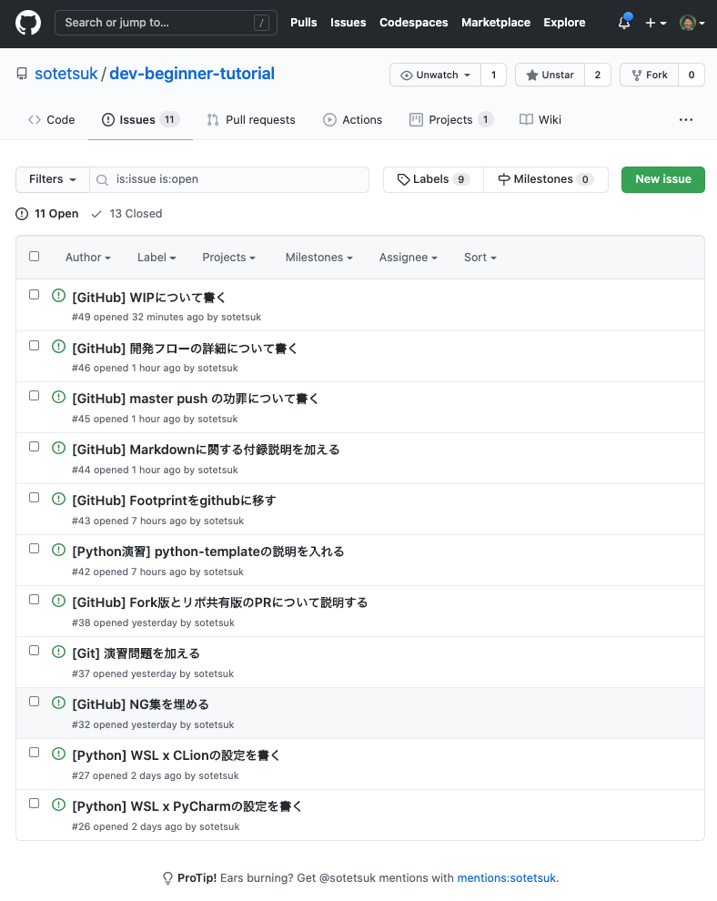

# GitHub入門

## :ok: これだけ！GitHub上での開発の流れ

はじめに、ここで学ぶことの結論をまとめてしまいます。GitHub上では、**Issueベースでのタスク管理**と、**Pull Request (PR) ベースでの開発**を行います。
    
[](https://github.com/sotetsuk/dev-beginner-tutorial/issues)

!!! important "Issueベースでのタスク管理"

    何か必要な機能や修正があれば、まずIssueを作成して「なぜこの機能・修正が必要なのか」「その仕様は何なのか」を書き出します。
    実際に開発に移る機能や修正は、Issueリストの中から優先順位やタスクの依存関係などに応じて決定します。


!!! important "Pull Request (PR) ベースでの開発"

    1. 実装する機能・修正の仕様を決めます（解決するIssueを決めます）。
    1. `main` に移り、リモートリポジトリから最新の変更を取り込みます。 `git switch main && git pull origin main`
    2. 新しい機能を実装するブランチを `main` から作ります。 `git switch -c <branch name>`
    3. ブランチ上で機能を実装します。
        3. 変更を実装し、適宜コミットします。 `git add <file>` `git commit -m "<commit message>"`
        4. 適宜プッシュします。 `git push -u origin <branch name>` 特に、最初のコミット直後には一度プッシュしてPRを作り、Issueと関連付けます。
    5. 機能が完成したら、レビュー前に最新の `origin/main` を取り込みます。 `git fetch && git merge --no-ff origin/main` （競合が発生した場合は解決する）
    6. レビューを経てPRを `main` に "Squash And Merge" でマージします。

## :question: なぜGitHubの使い方を学ぶのか？

GitHubは、最も広く使われているソフトウェア開発のプラットフォームです。
前章で学んだGitのリポジトリを管理してくれる他、開発に必要な様々な便利な機能を提供してくれています。
多くのソフトウェアがGitHub上でオープンソースソフトウェア（OSS) として開発されており、
開発者がGitHub上で開発されたソフトウェアを使わない日はありません。
大学でも会社でも、チームでの開発においてGitHubを使う可能性はかなり高く、Gitに加えてGitHubの使い方を習得するのは現代エンジニアにとって必須だと言えます。

## :orange_book: GitHubを用いた基本的な開発の流れ

Git/GitHubを用いた開発フローに、何か一つの正解があるというわけではありません。
チームやプロジェクト毎に、それぞれの異なる開発フローやルールが存在するでしょう。
ただし、基本的な開発フローを一つ学べば、プロジェクトやチームに加わったあとですぐにキャッチアップできるはずです。
ここでは、シンプルかつよく知られたGit/GitHub上での開発フローである、GitHub Flowを参考に、GitHub上でのシンプルな開発の流れについて説明します。

!!! quote ""

    [GitHub Flow](http://scottchacon.com/2011/08/31/github-flow.html) [[日本語訳](https://gist.github.com/Gab-km/3705015)]

### :arrow_forward: Issueベースでのタスク管理

何か必要な機能や修正がある場合、まず、新しいIssueを作ります。
Issueには、

1. 一体どんな新しい機能・修正が必要なのか
2. なぜそれが必要なのか

などを書くと良いでしょう（チームやプロジェクトによって、書くべき項目がより細かく決まっている場合もあります）。
まずIssueに書くことによって、思いついた機能や修正をやみくもに思いついた順番に実装していくのではなく、
タスクを整理してから優先順位やタスクの依存関係などに応じて実装していくことが可能になります。

| [新しいIssueを作成する](https://github.com/sotetsuk/dev-beginner-tutorial/issues/new) | [投稿された未解決のIssueリスト](https://github.com/sotetsuk/dev-beginner-tutorial/issues) |
|:---:|:---:|
|  |  |

### :arrow_forward: PRベースでの開発

GitHub Flowでは、デフォルトブランチである `main` ブランチを**常に最新で問題がない（テストが通る）状態に保ち**、
すべての新しい機能追加・修正を `main` ブランチから新しくブランチを派生させることで実装していきます。
Issueの中から、解決すべきIssueを決め、何を実装すべきかが定まったら、まず `main` ブランチから新しいブランチを作成しましょう。

まず、 `main` ブランチに移り、リモートブランチから最新の情報を取り込みます。

```sh
$ git switch main
$ git pull origin main
```

更新できたら、実装をしていくブランチを新しく作ります。

```sh
$ git switch -c <new-branch-name>
```

ここで、ブランチ名はある程度、実装する機能や修正の内容がわかるよう心がけましょう。

ブランチを切ったら、そこで実装をして、こまめにコミットをしていきます。コミットメッセージもある程度、
どんな実装をしたのか分かるようにしていきましょう。

```sh
$ git add <file>
$ git commit -m "<commit message>"
```

最初のコミットのあとに、ブランチをプッシュしてPull Request (PR) を作り、他のチームメンバに状況を共有し、議論可能にします。

```sh
$ git push -u origin <new-branch-name>
```

PRの作成は、GitHubのサイトから行うことができます。


## :police_officer: Git/GitHubでの開発におけるルール

## :book: TIPS

絶対というわけではないが、よく見かけるある程度合理的なTIPSです。

!!! tip "Mergeを "Squash And Merge" にする"

!!! tip "ブランチ名に作業者の名前や変更の種類を先頭につける"

    誰がどんな変更を加えているブランチなのかの視認性が少し良くなります。

    - `sotetsuk/feat/new-nn-model`
    - `sotetsuk/refactor/remove-comments`
    - `sotetsuk/docs/how-to-use`

## :dizzy: オススメの設定

設定ファイル `~/.gitconfig` を次のように編集してみましょう。

```yaml
[user]
    name = <YOUR NAME>
    email = <YOUR E-MAIL>
[alias]
    sw = switch
    br = branch
[push]
    default = current
[merge]
    ff = false
[pull]
    ff = only
```

!!! quote ""
    - [gitのpush.defaultに関するノウハウ | Qiita](https://qiita.com/awakia/items/6aaea1ffecba725be601)
    - [git merge 時は必ずマージコミットを作るようにする | Hatena blog](https://neos21.hatenablog.com/entry/2017/06/18/080000)

## :pencil: 演習

このドキュメント自体もGitHub上で書かれています :fontawesome-brands-github: 

!!! important ""

    [github.com/sotetsuk/dev-beginner-tutorial](https://github.com/sotetsuk/dev-beginner-tutorial)

:white_check_mark: このドキュメントのリポジトリに、実際にPRを作成して送ってみましょう。
[index.md](https://github.com/sotetsuk/dev-beginner-tutorial/blob/main/docs/index.md)の足跡に自分のGitHubのアイコンを追加してみましょう。

:white_check_mark: また、このチュートリアル自体のコンテンツについても修正点を考えてIssueやPRを送ってみましょう。
例えば、次のようなPRを送ってみて下さい。

!!! example ""

    1. タイポをIssueで報告する and/or PRで修正する。
    2. 表記ゆれをIssueで報告する and/or PRで修正する。
    3. 不正確・誤っている説明をIssueで報告する and/or PRで修正する。
    4. 要望・改善案をIssueで報告する。

