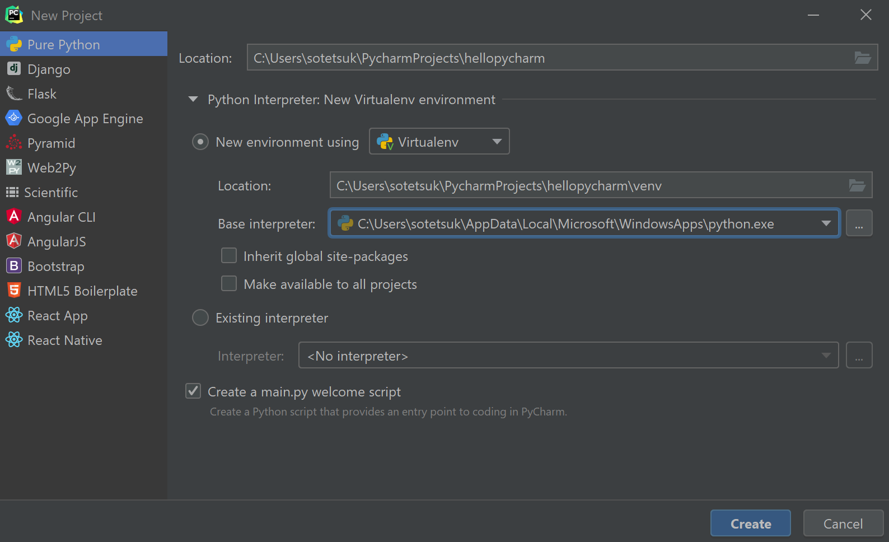
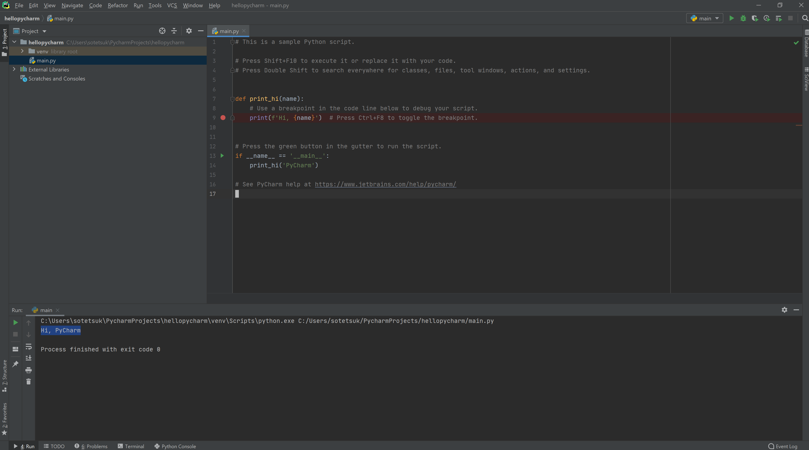
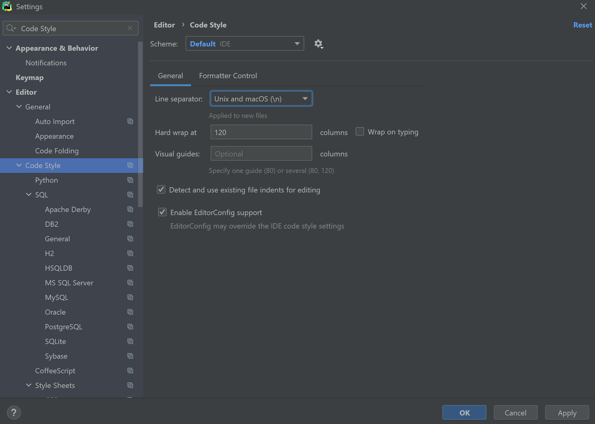

# Python入門

## :question: なぜPythonを学ぶのか

様々なプログラミング言語がありますが、**Python**は今最も学ぶ価値の高い言語の一つです。Pythonは人工知能やデータサイエンスとの相性が良く、学習コストも低いため、**最初に学習するプログラミング言語として最も優れている**と言って過言でありません。実際、マサチューセッツ工科大学 (MIT) では、コンピュータサイエンス入門コースでPythonを採用しています。学習コストが低いと言っても、Pythonの機能に何か制限があるというわけではなく、**最先端の人工知能研究からWebサービスの開発に至るまで**、様々な場面で最大限に活用できます。ここでは、Pythonの基本的な文法とプログラミングの基本を学びましょう。

!!! info "Pythonと人工知能"
    GitHubにおいて、"Machine learning"で検索をすると、**PythonとJupyter Notebookで書かれたリポジトリの数が、他を圧倒しています。**
    もはや、Pythonは人工知能分野における共通言語と言っても過言ではありません。

    

!!! example "Pythonを使っている有名なサービス例"
    > [10 Famous Websites Built Using Python](https://learn.onemonth.com/10-famous-websites-built-using-python/)

    PythonはWebサービスの開発においても人気の高い言語の一つです。多くの有名サービスがPythonをバックエンドで活用しています。
    人工知能技術の産業界への輸出がこれからも続くことを考えれば、この傾向は今後も続くと予想するのが自然でしょう。

    

## :computer: 事前準備（環境設定）

Pythonを開発・実行する環境としては、ローカルマシン（自分の手元のPC）に加えて、サーバ上の[Jupyter Notebook](https://jupyter.org/)形式を選択することもできます。必要に応じてローカルマシンと使い分けてみましょう。

### [Google Colab](https://colab.research.google.com/)

Google ColabはGoogleが提供するJupyter Notebook形式でのPython実行環境サービスです。Google Colabを活用すれば、環境構築の労力ゼロでPythonを使い始めることができます。特に、**データの集計や可視化**などの場面では、Google Colabのようなノートブック形式でPythonを実行するのが便利です。また、無料でGPUが利用できるので、**深層学習モデルの学習**にも使えます。

!!! warning ""
    学習教材で2.の東大の教材を選択する場合は、Google Colabだけで簡潔するため、ローカルマシンの環境構築 (PyCharmの導入) は後回しにしても問題ありません。

### [PyCharm](https://www.jetbrains.com/ja-jp/pycharm/)

PyCharmは非常に高性能なローカルマシンでの統合開発環境です。WindowsでもMacでも、まずPyCharmをインストールして下さい。Google Colabより導入に一手間かかりますが、ある程度**規模の大きいソフトウェアの開発**では、ローカルマシンで統合開発環境を使うのが必須になります。学生は無料でプロフェッショナル版を使うことができます。

!!! warning ""
    モダンなPython開発環境としては、他にも[Visual Studio Code](https://code.visualstudio.com/)が選択肢に入りますが、拡張機能や設定が必要なので、初学者にはデフォルトで最初から便利なPyCharmがオススメです。
    
    WindowsではUNIXコマンドの学習のときにインストールしたWSLと連携して使って下さい。[SSH を使用して WSL ベースのリモートインタープリターを作成する | PyCharm](https://pleiades.io/help/pycharm/using-wsl-as-a-remote-interpreter-1.html)

=== "Mac"

    PyCharmをインストールした後、新しいプロジェクトを作成してみてテストしてみましょう。

=== "Windows"

    PyCharmをインストールした後、新しいプロジェクトを作成してみてテストしてみましょう。
    New Projectを選択し、次の画面を参考に、virtualenvを使ってPythonインタプリタを使うようにしてください。

    

    このとき、Pythonのインタプリタがないと言われた場合、エラーメッセージにしたがって、Microsoft storeからPython3.9（あるいは3.8）をインストールして下さい。
    Pythonインストール後、緑色の三角の実行ボタンを押してみて、Pythonが動くことを確認しましょう。

    

    最後に、**設定から改行コードをUNIXに揃えるよう設定して下さい。**

    

## :orange_book: 学習教材

次の教材から好きなものを選んでPythonの文法とプログラミングの基礎について勉強しましょう。**2.3.4.5.のどれか一つ**選択して学習してみましょう。

1. [はじめてのPython | ドットインストール](https://dotinstall.com/lessons/basic_python_v4) （有料）
    - このドットインストールのコースは90分もかからないと思うので、短時間で達成感が得られると思います。基本的にこの教材で素早く全体像を掴んでから2.3.4.のどれかで本格的に勉強していくのが良いと思います。
2. [Pythonプログラミング入門 #utpython | 東京大学 数理・情報教育研究センター ](https://sites.google.com/view/ut-python/resource/%E6%95%99%E6%9D%90%E8%AC%9B%E7%BE%A9%E5%8B%95%E7%94%BB)
    - Colab上だけで簡潔するので、Python文法やプログラミングの基礎についてのみ集中できる。
3. [プログラミング演習 Python 2019 | 京都大学学術情報リポジトリ KURENAI 紅](https://repository.kulib.kyoto-u.ac.jp/dspace/handle/2433/245698)
    - ビデオなしの教材なので、1.を勉強した後であれば適宜読み飛ばして行けると思います。GUIのプログラミングや、Tic-Tac-Toeを作るといった面白い題材が多い。
4. [Introduction to Computer Science and Programming in Python | MIT OpenCourseWare](https://ocw.mit.edu/courses/electrical-engineering-and-computer-science/6-0001-introduction-to-computer-science-and-programming-in-python-fall-2016/index.htm)
    - 英語が問題ない方はこちらがオススメです。より本格的なコンピュータサイエンス入門になっています。
5. [Python3入門 | ドットインストール](https://dotinstall.com/lessons/basic_python_v3)（有料）
    - ドットインストールのより詳細なPython入門です。有料ですが、文法だけ学ぶという観点ではこれが一番いいかなと思います。

## :pencil: 演習

これらの演習問題を通じて、基本的な制御構文やデータ構造 (`if`, `for`, `while`, `list`, `dict`, `set`) が使いこなせるか確認しましょう。

:white_check_mark: [AtCoder Beginners Selection | AtCoder](https://atcoder.jp/contests/abs/tasks) の問題をPythonで解いてみましょう。

:white_check_mark: [アルゴリズム実技検定 (PAST)](https://past.atcoder.jp/) の過去問題を解いてPythonで解いてみましょう。

- [第一回 アルゴリズム実技検定](https://atcoder.jp/contests/past201912-open) のA~F（計6問）
- [第二回 アルゴリズム実技検定](https://atcoder.jp/contests/past202004-open) のA~F（計6問）
- [第三回 アルゴリズム実技検定](https://atcoder.jp/contests/past202005-open) のA~F（計6問）
- [第四回 アルゴリズム実技検定](https://atcoder.jp/contests/past202010-open) のA~F（計6問）

!!! warning "追加で必要な知識"

    - [itertools.permutations | docs.python.org](https://docs.python.org/ja/3/library/itertools.html#itertools.permutations) - 順列の列挙が行えます。
    - [heapq | docs.python.org](https://docs.python.org/ja/3/library/heapq.html) - どのようなデータ構造か、自分で調べてみましょう。

:white_check_mark: 前回、UNIXコマンドで実行した[第2章: UNIXコマンド | 言語処理100本ノック](https://nlp100.github.io/ja/)の問題を、今度はPythonで実装、実行してみましょう。
