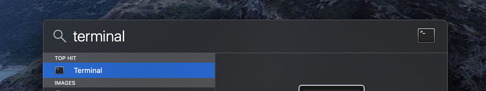
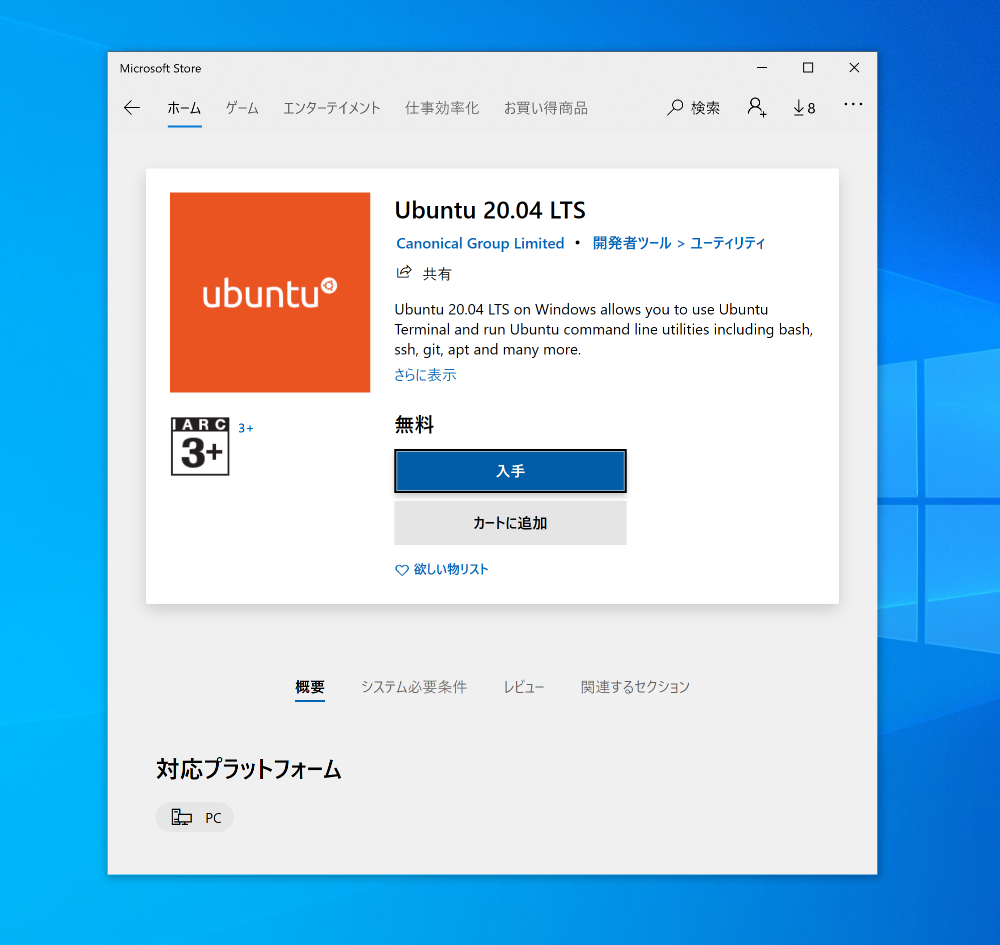

# UNIXコマンド入門

:question: なぜUNIXコマンドを学ぶのか

私達がこれから開発するシステムの多くは、開発する環境がWindowsであれ、Macであれ、最終的には[サーバ](https://ja.wikipedia.org/wiki/%E3%82%B5%E3%83%BC%E3%83%90)上で稼働する場面が圧倒的に多いです。
これは大学の研究でも、会社でのシステム開発でも同じことです。
私達が慣れ親しんでいるスマホのゲームも、SNSサービスも、私達のスマホやパソコンが（アプリやブラウザを介して）サーバと情報のやり取りをしています。
そしてそれらのサーバは、[Ubuntu](https://ja.wikipedia.org/wiki/Ubuntu)のような[Linux](https://ja.wikipedia.org/wiki/Linux)ベースのOSを使うのが一般的です。
私達が普段パソコンを操作するとき、グラフィカルな画面を見ながらマウスを使って操作しているのとは対象的に、
Linuxベースのサーバでは、[CUI](https://ja.wikipedia.org/wiki/%E3%82%AD%E3%83%A3%E3%83%A9%E3%82%AF%E3%82%BF%E3%83%A6%E3%83%BC%E3%82%B6%E3%82%A4%E3%83%B3%E3%82%BF%E3%83%95%E3%82%A7%E3%83%BC%E3%82%B9)を介して操作するのが一般的ですし、（慣れていれば）効率的です。
CUIからの操作は、ターミナルから**UNIXコマンド**を入力することで行います。
UNIXコマンドによる操作は、1000個のファイルを連番で作るといった操作の**自動化**や、複雑な操作をコマンドとしてファイルに書き出して保存しておくことで、**再現性**の担保がしやすいといったメリットがあります。
ここでは、基本的なUNIXコマンドを学ぶことで、私達の書いたプログラムを最終的にLinuxシステム上で動作させるための準備をします。


比較的身近なLinuxサーバの例として次のようなものが挙げられます。

!!! example "スパコンシステム"

    京都大学情報学環境機構の提供するスパコンシステムは、Linuxサーバです。実際、マニュアルにはUNIXコマンドの簡単なチュートリアルがあります。

    > [スーパーコンピュータシステムの使い方 | 京都大学学術情報メディアセンター](https://web.kudpc.kyoto-u.ac.jp/manual/ja)

!!! example "ソーシャルゲーム会社のサーバ構成事情"

    DeNAのような民間企業では、自社で[オンプレミス](https://ja.wikipedia.org/wiki/%E3%82%AA%E3%83%B3%E3%83%97%E3%83%AC%E3%83%9F%E3%82%B9#:~:text=%E3%82%AA%E3%83%B3%E3%83%97%E3%83%AC%E3%83%9F%E3%82%B9%EF%BC%88%E8%8B%B1%E8%AA%9E%3A%20on%2Dpremises,%E5%9E%8B%EF%BC%89%E3%81%A8%E3%82%82%E8%A8%B3%E3%81%95%E3%82%8C%E3%82%8B%E3%80%82)にサーバを用意したり、[AWS](https://aws.amazon.com/jp/)のようなクラウドサービスを利用することで、サーバを通じてユーザにサービスを提供しています。これらのサーバも基本的にLinuxサーバです。こうしたサーバをどう構成するかという問題も、ビジネス上重要な課題となることがあります。

    > [オンプレミスに強みをもつDeNAはなぜクラウド化を決めたのか？ その舞台裏と今後の展望](https://fullswing.dena.com/archives/2638)

## :computer: 事前準備（環境設定）

=== "Mac"

    Macにデフォルトで入っているターミナル (Terminal) アプリを開きましょう。
    [Spotlight](https://support.apple.com/ja-jp/HT204014)から検索することで起動できます。

    

=== "Windows"
     Windows Subsystem for Linux (WSL) を利用することで、Windows上でUbuntu20.04を使いましょう。
     下記リンクのガイダンスに従って、WSLをインストールして下さい。

    > [Windows 10 用 Windows Subsystem for Linux のインストール ガイド](https://docs.microsoft.com/ja-jp/windows/wsl/install-win10)
    
    


## :orange_book: 学習教材
どちらか一つコースを選択してUNIXコマンドの基本的な操作方法を学んでみましょう。

1. [**UNIXコマンド入門 | ドットインストール**](https://dotinstall.com/lessons/basic_unix_v3)（有料）
2. [はじめてのUNIXコマンド入門講座 | TechAcademy](https://www.youtube.com/watch?v=BLFPr2DsDys&list=PLjw-30bsJNVWvKT9G3n43GoeqOMmdweuQ)

!!! warning "UNIXコマンド入門 (ドットインストール) の注意点"
    動画で扱っているOSがAlpineなので少しMacやUbuntuと勝手が違う点があるので注意してください。例えば、 `ash` は `bash`と読み替えて下さい。

## :white_check_mark: 習熟度チェック

!!! check "絶対パスと相対パス"
    絶対パスと相対パスの違いを説明できるか確認してみましょう。

!!! check ""パスを通す""
    "パスを通す"という言葉の意味を理解できているか確認してみましょう。

    > [Pathを通すとは、環境変数とは | Qiita](https://qiita.com/fuwamaki/items/3d8af42cf7abee760a81)

!!! check "使用頻度の高いコマンド"
    学習教材で説明されているような、基本的かつ使用頻度の高いコマンドの使い方が分かるか確認してみましょう。
    例えば、この文章の著者 (@sotetsuk) の使用頻度の高いコマンドは次の表のようなものでした。
    下記表の `git`, `python`, `docker` 以外のコマンドがどんなコマンドか分かるか確認しましょう。

```sh
history | awk '{print $2}' | sort | uniq -c | sort -rn | head -n 10
```

| 順位 | コマンド | 用途 |
|:---:|:---|:---|
| 1 | git  | Gitを起動する |
| 2 | ls   | ファイルやディレクトリを表示する (list) |
| 3 | cd   | ディレクトリを移る (change directory) |
| 4 | vi   | vimエディタを起動する |
| 5 | cat  | ファイルを表示したり、結合したりする (catenate) |
| 6 | rm   | ファイルやディレクトリを削除する (remove) |
| 7 | cp   | ファイルやディレクトリをコピーする (copy) |
| 8 | python| Pythonを起動する |
| 9 | docker| Dockerを起動する |
| 10 | less | ファイルの内容をスクロール可能な形で表示する |

!!! check ""使用頻度の高いコマンドを求めるコマンド""
    上記の使用頻度の高いコマンドを求める操作自体も、コマンドをパイプで繋げることで実現しています。それぞれのコマンドがどんなコマンドか確認してみましょう。また、**パイプ**の使用方法を確認してみましょう。

!!! check "その他の使用頻度上位のコマンド"
    その他、@sotetsukの使用頻度上位のコマンドには次のようなものがありました。知らないコマンドがあったら、どんなコマンドか調べてみましょう。今は使い方を完璧に知らなくても、こんなコマンドがあったな、と覚えていれば必要に応じて使い方を調べて活用することができます。

**その他の使用頻度が高かったコマンドリスト**

|コマンド|用途|
|:---|:---|
| mkdir| ディレクトリを作る (make directory) | 
| pwd | 現在いるディレクトリの絶対パスを表示する (print working directory) | 
| mv| ファイルやディレクトリを移す (move) | 
| head| ファイルや入力の最初の方の行を表示する | 
| tail| ファイルや入力の最後の方の行を表示する | 
| split| ファイルや入力を行毎で小さなファイルに分割する | 
| cut| ファイルや入力の各行の一部分を切り取る | 
| which| コマンドの実行プログラムのパスを調べる | 
| find| ファイルやディレクトリを探す | 
| grep| ファイルや入力から一致する表現を検索・出力する | 
| touch| 空ファイルを作ったり、最終変更時刻を更新する | 
| ssh | 安全に遠隔マシンに接続する (secure shell) | 
| ping| 遠隔マシンとネットワークが疎通しているか確認する | 
| curl| データ転送・APIの利用に使われる | 
| awk| ファイルや入力を柔軟に加工をする | 
| sed| ファイルや入力に特定の変更を加える (stream editor) | 


## :pencil: 演習

[第2章: UNIXコマンド | 言語処理100本ノック](https://nlp100.github.io/ja/)の問題を解いてみましょう。これらの問題は、特定のUNIXコマンドと同等の動作をするプログラムを実装するのが課題となっていますが、ここではUNIXコマンドを使ってみるだけで十分です。

## :gift: 付録
興味のある方は、さらにこれらのレッスンを学習してみてください。

- [vim入門 | ドットインストール](https://dotinstall.com/lessons/basic_vim)
- [シェルルクリプト入門 | ドットインストール](https://dotinstall.com/lessons)（有料）